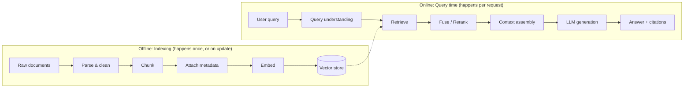
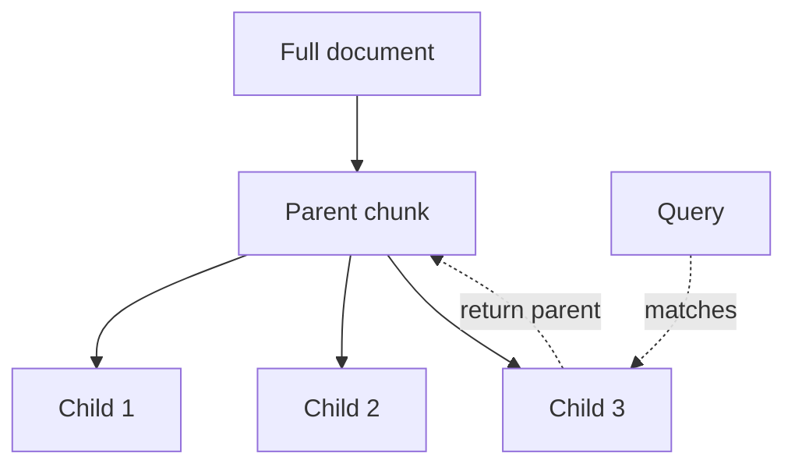
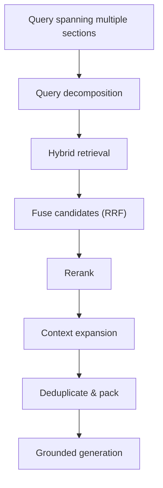

# Batch 001 — RAG, Retrieval, LangGraph & GraphRAG

Source: user-supplied reported interview experiences, ingested 22 Sep 2026.
Expanded 23 Sep 2026 with detailed explanations, diagrams, follow-up
questions, and mapping to the TxnGuard RAG project.

## Evidence summary

This batch strongly clusters around retrieval engineering: embeddings,
chunking, hybrid retrieval, BM25, RRF, multi-stage retrieval, distributed
evidence across pages, graph retrieval, LangGraph orchestration and MCP
design choices.

## 1. What are embeddings?

**30-second answer:** An embedding is a dense numerical vector representing
an item such as text so that semantic relatedness can be measured
geometrically. Similar meanings tend to map to nearby vectors, which
enables semantic retrieval, clustering and recommendation.

**Detailed answer:** An embedding model is trained (usually contrastively —
pulling semantically similar pairs together, pushing dissimilar pairs
apart) so that a sentence like "the client's account was flagged for
unusual activity" ends up numerically close to "suspicious transaction
detected on the account," even though they share almost no words. This is
what makes embeddings different from a simple keyword index: a query
using different wording than the source document can still find it.

Each embedding is typically a vector of 384 to 3072 numbers (dimensions),
depending on the model. Every dimension doesn't correspond to something
human-interpretable like "is this about money" — the meaning is encoded
across the whole vector, learned during training, not designed by hand.

**Direction vs magnitude:** Direction generally carries the semantic
pattern used by similarity measures such as cosine similarity. Magnitude
is model- and normalization-dependent; do not claim it universally
represents "importance." With normalized vectors, magnitude is fixed and
cosine similarity effectively compares direction.

**Where embeddings fail:** exact identifiers, account numbers, rare
regulatory terms the model has never seen, and numbers in general —
embeddings are bad at treating "3x average" and "5x average" as
meaningfully different, since both are numerically close as text. This is
precisely why hybrid retrieval (Question 5) exists.

**TxnGuard connection:** When you embed chunks of the fraud typology
reference and the KYC/AML policy in Stage 1, a query like "what should I
do if a dormant account suddenly transacts?" needs to retrieve Section 6.2
of the typology doc even though that exact phrase never appears there —
that's the semantic-matching payoff. But a query like "Clause 4.3
escalation window" is better served by exact keyword match, since "4.3"
carries no useful semantic signal to an embedding model.

**Follow-up questions:**
- *Q: How do you choose an embedding model?* — Balance dimensionality
  (higher = more nuance, more storage/compute), domain fit (a model
  trained on general web text vs. one fine-tuned on financial/legal text),
  context length limits, and cost/latency if using an API-based model vs.
  a local one.
- *Q: What happens if you change embedding models after indexing?* — Every
  existing vector becomes incomparable to new query vectors from a
  different model; you must re-embed and re-index the entire corpus. This
  is a real operational cost worth mentioning when discussing production
  RAG.
- *Q: Can two completely different sentences have a high cosine
  similarity by coincidence?* — Yes, especially with short or generic
  text; this is one reason retrieval quality needs to be measured (see
  Batch 004, Question 4), not assumed.

**Resources:**
- OpenAI embedding model docs: https://developers.openai.com/api/docs/models/text-embedding-3-large

## 2. What is RAG and how does it work?

**30-second answer:** Retrieval-Augmented Generation retrieves external
evidence relevant to a query and supplies that evidence as context to a
generative model. A production flow is typically ingest → parse → chunk →
enrich metadata → embed/index → query understanding → retrieve →
fuse/rerank → context assembly → grounded generation → citations →
evaluation.

**Detailed answer:** The core insight behind RAG is separating *knowledge*
from *reasoning*. The LLM's weights encode reasoning ability and language
fluency, learned once during training and expensive to change. Retrieval
supplies knowledge — facts, documents, policies — that can be updated by
just re-indexing, no retraining required. This split is what makes RAG
attractive for anything that changes often (policy updates) or is private
(a company's own documents, never seen during model training).

**Why it exists:** It lets applications use current/private/domain data
without encoding all of it into model weights, and provides evidence that
can be inspected — a citation the reviewer can click through to, rather
than an LLM's unverifiable claim.

**TxnGuard connection:** This diagram *is* your Stage 1 through Stage 4
build, in order. Right now you have the "offline" half not yet built
(Phase 1: ingestion is what you just wrote `load_all_documents` for). The
"online" half — query, retrieve, generate — is Phase 5 in our plan.

**Follow-up questions:**
- *Q: Why not just put the whole corpus in the prompt every time
  (long-context stuffing)?* — Cost scales with every token sent on every
  request, latency grows, and models handle very long contexts unevenly
  ("lost in the middle" — text buried in the center of a long context gets
  attended to less than text near the start or end). RAG sends only what's
  relevant.
- *Q: What's the difference between RAG and just fine-tuning the model on
  your documents?* — Fine-tuning bakes patterns into weights — good for
  changing behavior/style/format, bad for facts that change often or need
  per-user access control. RAG keeps facts external and swappable. See
  Batch 004 Question 1 for the fuller comparison.
- *Q: What can go wrong at each stage of this pipeline?* — Bad
  chunking loses context; embedding mismatch misses semantically distant
  phrasing; retrieval returns irrelevant chunks; the LLM ignores good
  context and hallucinates anyway. Each stage needs to be debuggable
  independently — this is exactly Batch 004 Question 7's debugging
  framework.

**Resources:**
- Microsoft RAG overview: https://learn.microsoft.com/en-us/azure/search/retrieval-augmented-generation-overview

## 3. Chunking strategies

**30-second answer:** Know fixed-size/token chunks, overlap,
sentence/paragraph chunks, recursive splitting, semantic chunking, and
structure-aware/hierarchical chunking. For legal/long structured documents
prefer preserving headings, clauses, page/section identifiers and
parent-child relationships rather than blindly slicing every N tokens.

**Detailed answer:** Chunking exists because embedding models encode a
fixed-size input into one vector. Cram five unrelated paragraphs into a
chunk and the resulting vector averages over all of them — it won't score
highly for a query about any single one of those paragraphs. Chunk too
small (one sentence) and you lose the surrounding context needed to
understand what that sentence is even about.

**Fixed-size chunking** — split every N tokens with some overlap. Simple,
predictable, but cuts through meaning arbitrarily.

**Recursive/structure-aware chunking** — split along the document's own
structure first (headings → sections → paragraphs), falling back to
sentence or token splits only within a section that's still too long.

**Parent-child chunking** — index small chunks for retrieval precision
but return a larger parent section as the actual context sent to the LLM.

**TxnGuard connection:** The corpus uses numbered clauses and cross-references, making structure-aware chunking useful.

**Follow-up questions:**
- *How would you choose chunk size?* Inspect structure and real query patterns; tune against retrieval metrics.
- *Trade-off of overlap?* Better boundary safety vs redundancy/noisier retrieval.
- *Tables/cross-references?* Preserve contextual relationships and metadata.

**Resources:**
- Weaviate: https://www.weaviate.io/blog/chunking-strategies-for-rag
- Stack Overflow Blog: https://stackoverflow.blog/2024/12/27/breaking-up-is-hard-to-do-chunking-in-rag-applications/

## 4. 10 MB PDF: relevant information distributed across pages/partitions

**30-second answer:** Do not solve this by increasing top-k alone. Preserve
document/page/section/parent IDs, retrieve child chunks, use hybrid search,
fuse and rerank, then expand around strong hits using adjacent chunks,
parent sections and cross-references before context packing.

**Key idea:** the question becomes “which set of chunks together answers this?” rather than “which single chunk is relevant?”

## 5. Why BM25 along with vector retrieval?

BM25 is strong for exact lexical signals; dense retrieval captures semantic similarity. Hybrid retrieval combines complementary strengths. Fuse result lists rather than naïvely adding incompatible raw scores.

## 6. What is RRF?

Reciprocal Rank Fusion merges ranked lists using positions rather than raw scores:

`RRF(d) = Σ 1 / (k + rank_i(d))`

Documents ranked highly by several retrievers rise.

## 7. Dense vs sparse retrieval

Sparse retrieval uses sparse term features (e.g. BM25). Dense retrieval maps text into learned vectors. Hybrid uses both.

## 8. Why multiple retrieval nodes?

Separate retrieval nodes when sources or strategies differ in latency, routing, filtering, error handling or observability.

## 9. Why LangGraph?

Use LangGraph when you need explicit state, conditional routing, durable execution/checkpointing, retries, human intervention or clear workflow boundaries.

## 10. What are LangGraph nodes?

Nodes are discrete units of work operating on shared graph state. They can call LLMs, tools, retrieval systems, validation steps, or humans and return state updates.

## 11. Why Neo4j?

Use Neo4j when relationships are first-class retrieval evidence: multi-hop questions, dependency chains, entity neighborhoods and hierarchies.

## 12. Complete retrieval workflow

Query → intent analysis → optional decomposition/routing → parallel dense/BM25/graph/structured retrieval → metadata/security filters → fusion → reranking → context expansion → dedupe/context packing → grounded generation → citations → evaluation.

## 13. Why didn't I use MCP?

MCP is useful for standardized reusable tool/context integration across hosts/agents. Direct integrations can be simpler when tools are app-specific and tightly controlled.

**Resources:**
- LangGraph: https://docs.langchain.com/oss/python/learn
- Neo4j GraphRAG: https://neo4j.com/docs/neo4j-graphrag-python/current/
- MCP: https://modelcontextprotocol.io/specification/2025-11-25/architecture
