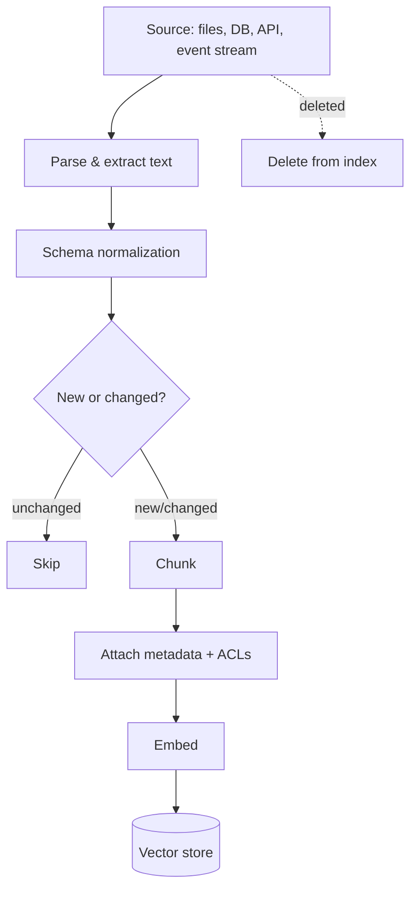
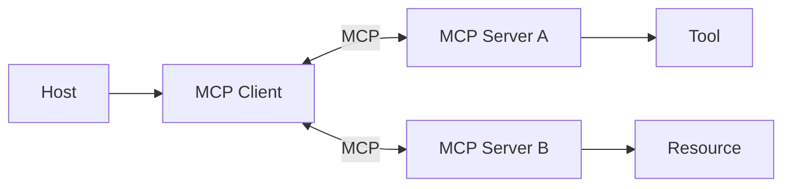

# Batch 002 — Cloud, Inference & GenAI System Design

Source: user-supplied reported interview experience, ingested 22 Sep 2026.
Expanded 23 Sep 2026 with detailed explanations, diagrams, follow-up
questions, and mapping to the TxnGuard RAG project.

## High-priority question map

## 1. Enterprise ingestion

**30-second answer:** Discuss connectors/events/batch ingestion, parsing,
schema normalization, metadata/ACL preservation, deduplication, chunking,
embedding/indexing, retries/idempotency, lineage, incremental updates and
deletion propagation.

**Detailed answer:** Enterprise ingestion is an ongoing pipeline, not a one-time script. Production concerns include idempotency, incremental updates, deletion propagation, ACL preservation, lineage and retries.

## 2. Confidential documents / redaction

**30-second answer:** Defence in depth: classify data → enforce source ACLs during retrieval → redact/tokenize where appropriate → encrypt → least privilege → tenant isolation → audit → control provider handling → protect traces/logs.

Redaction is not authorization. Unauthorized data should not be retrieved in the first place.

## 3. Legal-document chunking

Prefer structure-aware boundaries, preserve citations/page/section IDs, use parent-child retrieval, metadata filtering and context expansion. Legal docs often require cross-reference awareness and version metadata.

## 4. RAG cost reduction

Measure first. Typical levers: smaller models where acceptable, caching, incremental indexing, query routing, controlled top-k/context length, batching, reusable summaries, tiered model routing.

## 5. Temperature

Lower temperature generally reduces sampling variation, but determinism also depends on model/version, seed support, infrastructure and retrieval/tool behavior.

## 6. MCP architecture

Host coordinates clients; clients connect to servers; servers expose tools/resources.

Resource: https://modelcontextprotocol.io/specification/2025-11-25/architecture

## 7. A2A

A2A is agent-to-agent interoperability. MCP is primarily agent/application-to-tools/context interoperability.

Resource: https://a2a-protocol.org/v1.0.0/

## 8. Amazon Bedrock AgentCore

AgentCore provides AWS infrastructure for deploying/operating agents, with services such as Runtime and Gateway.

Resources:
- https://docs.aws.amazon.com/bedrock-agentcore/
- https://docs.aws.amazon.com/bedrock-agentcore/latest/devguide/gateway-using.html

## 9. Object storage vs SQL

Object storage fits large/semi-structured immutable objects; SQL fits transactional structured state, constraints, joins and indexed relational queries. RAG systems often use both.

## 10. Data lake

Know raw/curated zones, catalogs/governance, batch/stream ingestion, processing, query engines, security and lineage.

## 11. LLaMA architecture

Prepare decoder-only Transformer fundamentals and LLaMA choices such as RMSNorm, SwiGLU and RoPE. Clarify model generation/version because newer Llama generations differ.

Resource: https://huggingface.co/docs/transformers/main/en/model_doc/llama

## 12. Benchmarking self-hosted inference vs managed AWS/Azure

Compare quality plus TTFT, inter-token latency, end-to-end p50/p95/p99, throughput/tokens/sec, concurrency, error rates, availability, GPU utilization, cold starts, max context, cost/request/token and operational burden.

## 13. Inference microservice

API/auth → validation → admission control → batching/scheduler → model runtime → streaming → metrics/tracing. Consider GPU memory, KV cache, model loading, autoscaling, graceful overload and model versioning.

## 14. Quantization

Lower-precision weights/activations reduce memory and may improve inference efficiency, with quality and hardware/kernel trade-offs. Know PTQ vs QAT conceptually.

## 15. Graph construction

Extract/ingest entities and relationships → normalize/entity resolve → create nodes/edges/properties → attach provenance → index → query/traverse.

## 16. Observability / traceability

Trace query transformation, retrieval, reranking, tools, prompt/model calls and output. Capture latency, tokens/cost, model version, document IDs/scores, tool errors and evaluation signals while protecting sensitive data.

## 17. CSV query solution

Small CSV: dataframe is fine. Large/repeated workloads: ingest into analytical SQL/columnar engine. Natural language querying should generate constrained/validated queries or code; preserve schema/types and sandbox execution.

## 18. Traditional ML topics

Prepare interview depth for:
- Logistic regression + sigmoid
- SVM + kernels
- time-series fundamentals + first differencing

Keep this compact unless more evidence increases priority.
