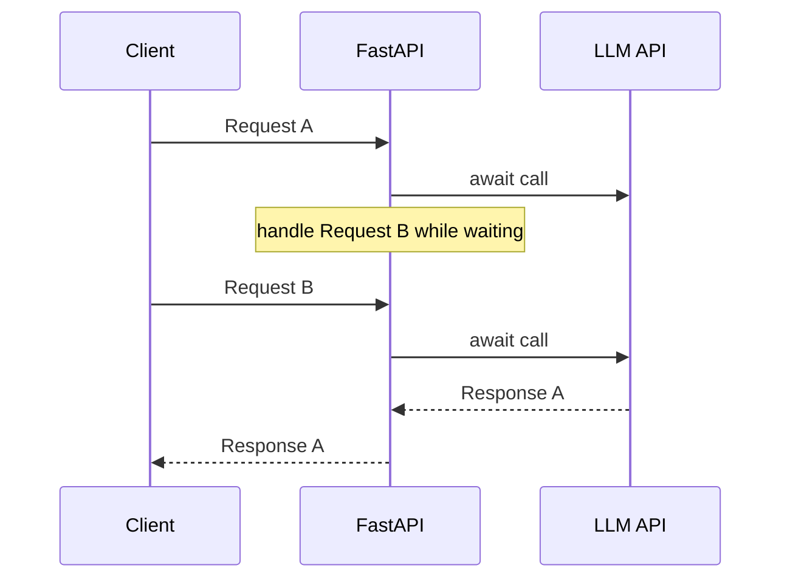
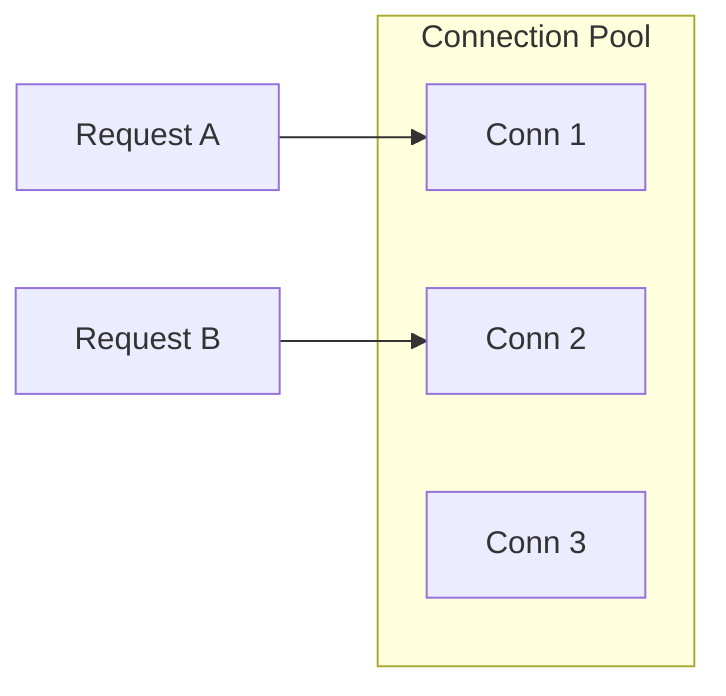

# Batch 003 — Python, Backend, RAG & Agents

Source: user-supplied reported MNC GenAI/Python interview experience,
ingested 22 Sep 2026. Expanded 23 Sep 2026 with detailed explanations,
diagrams, follow-up questions, and mapping to the TxnGuard RAG project.

## 1. Async: when and when not?

**30-second answer:** Use async for high-concurrency I/O-bound work where
dependencies expose non-blocking APIs: network calls, async DB drivers,
parallel retrieval/model calls. It improves utilization while tasks wait.
Do not expect async to speed CPU-bound work.

Resource: https://fastapi.tiangolo.com/async/

## 2. FastAPI benefits

Type-hint-driven validation, OpenAPI generation, async support, dependency injection, good performance and Pydantic integration.

Resource: https://fastapi.tiangolo.com/

## 3. Database connection string

A DB URL identifies dialect/driver, credentials, host/port, database and options. Credentials belong in secrets/config, not source code.

Resource: https://docs.sqlalchemy.org/en/21/tutorial/engine.html

## 4. Multiple users and DB connections

Do not create a permanent DB connection per user. Use an Engine/pool; each request checks out a connection/session for a short unit of work and returns it.

## 5. SQLAlchemy connection pool

The Engine manages a pool. Understand pool_size, max_overflow, pool_timeout, pool_recycle/pre_ping and session/transaction lifecycle.

Resource: https://docs.sqlalchemy.org/en/21/core/engines.html

## 6. Deterministic / consistent LLM output

Stabilize model/version, prompts, context ordering, structured output, sampling, tools and retrieval. Temperature alone is insufficient.

## 7. Conversation memory

Know:
- short-term/thread state
- sliding window
- summaries
- semantic/episodic long-term memory
- structured task/agent state

Keep only what is needed for the current decision and retrieve older memory on demand.

## 8. Long history

Use bounded recent history + structured state + summaries/checkpoints + selective retrieval of older relevant turns.

## 9. Does summarization increase cost?

Yes. It is worthwhile when one-time/periodic compaction saves more repeated tokens later. Trigger by thresholds and cache summaries rather than summarizing every request.

## 10. Agent gives a wrong answer: identify and correct

Trace:
user input → routing/planning → retrieval/tool args → tool output → state → prompt → model output.

Classify the failure (retrieval, tool, stale data, prompt, reasoning, generation, policy), reproduce it, fix the correct component, then add a regression/eval test.

## 11. Maximum subarray sum

Use Kadane's algorithm.

Maintain:
- current_best_ending_here = max(x, current + x)
- global_best = max(global_best, current_best_ending_here)

Initialize from the first element so all-negative arrays work.

Complexity: O(n) time, O(1) extra space.

Follow-ups:
- return indices
- explain why reset works
- all-negative input
- empty input contract
- brute-force vs Kadane
