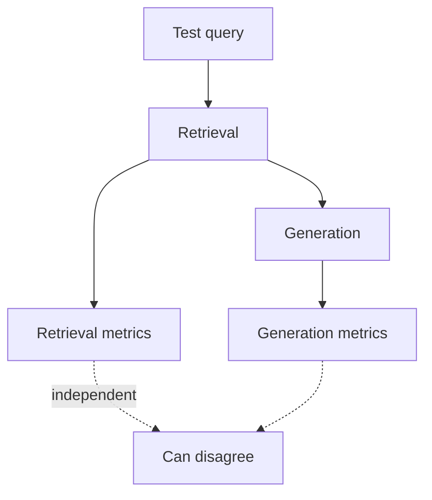
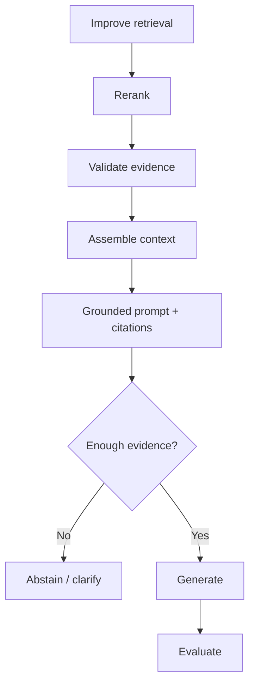

# Batch 004 — RAG Follow-up Interview Drill

Source: user-supplied LinkedIn interview-preparation post, ingested 23 Sep
2026. Expanded 23 Sep 2026 with detailed explanations, diagrams, and
mapping to the TxnGuard RAG project.

> Evidence note: this is an interview-preparation post, not a first-person
> interview report. It strengthens preparation relevance but is not
> counted as an additional independent interview experience.

## 1. Why RAG instead of fine-tuning?

**30-second answer:** Choose RAG when the problem is primarily knowledge
access rather than changing model behavior. If knowledge is private,
frequently updated, large, or answers need citations/provenance, retrieval
keeps knowledge outside model weights. Fine-tuning is more appropriate for
behavior, style, task performance or response format.

| | RAG | Fine-tuning |
|---|---|---|
| Update speed | Re-index | Retrain |
| Citability | Strong | Weak |
| Changes behavior/style | No | Yes |
| Private/frequently changing knowledge | Strong fit | Poorer fit |
| Stable output style/task specialization | Limited | Strong fit |

## 2. How did you decide chunk size?

Don't start from a magic token number. Inspect document structure and query patterns, preserve semantic units, then tune size/overlap against retrieval metrics and answer quality.

Smaller chunks improve precision but risk losing context; larger chunks preserve context but introduce noise and consume context window.

## 3. Which retrieval method did you use?

Compare:
- sparse/BM25
- dense/vector
- hybrid
- metadata filtering
- reranking

The strongest answer explains why the chosen method matched specific corpus/query failure modes.

## 4. How did you evaluate retrieval quality?

With labeled relevant chunks:
- Precision@K
- Recall@K
- MRR
- NDCG@K

Also evaluate context relevance and groundedness separately. A correct final answer does not prove retrieval was good.

Resources:
- https://learn.microsoft.com/azure/architecture/ai-ml/guide/rag/rag-information-retrieval
- https://learn.microsoft.com/en-us/azure/foundry/concepts/evaluation-evaluators/rag-evaluators

## 5. How did you reduce hallucinations?

Treat hallucination as a system problem:
1. improve retrieval recall;
2. rerank for precision;
3. filter/validate evidence;
4. assemble focused context;
5. require evidence-grounded answers and citations;
6. abstain/clarify when evidence is insufficient;
7. regression-test failures.

A better prompt alone cannot repair missing/wrong retrieval.

## 6. What if the correct document is not retrieved?

Diagnose first:
- query understanding failure
- indexing/chunking failure
- filtering failure
- ranking failure

Potential fixes:
- rewrite/expand/decompose query
- hybrid retrieval
- broaden candidate count
- reconsider filters/thresholds
- alternate source/index
- parent/adjacent context
- clarifying question
- abstain

Do not blindly lower thresholds.

## 7. Debug a plausible but wrong RAG answer

Trace:
Query understanding → Retrieval → Fusion → Reranking → Context assembly → Generation → Validation

Inspect whether evidence existed, whether it was indexed, retrieved, reranked, packed into context and correctly used by the model. Persist relevant trace information and add the failure as a regression test.

## Interview pattern

RAG interviews quickly move from definition to design justification, evaluation and debugging. Prepare the complete retrieval lifecycle, not memorized definitions.

## Authoritative resources

- https://learn.microsoft.com/en-us/azure/architecture/ai-ml/guide/rag/rag-solution-design-and-evaluation-guide
- https://learn.microsoft.com/azure/architecture/ai-ml/guide/rag/rag-information-retrieval
- https://learn.microsoft.com/en-us/azure/foundry/concepts/evaluation-evaluators/rag-evaluators
- https://learn.microsoft.com/azure/search/hybrid-search-ranking
